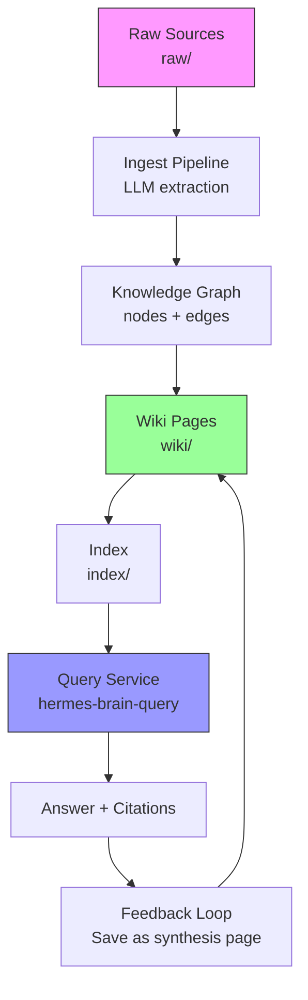

# `daily-learnings/` Repository Restructure — Proposal

**Date:** 2026-04-26
**Current State:** Ad-hoc research reports in root
**Target State:** Layered Second Brain architecture with raw → wiki → index pipeline

---

## Executive Summary

This document proposes restructuring the `/home/tokisaki/work/synthesis/` repository from a flat collection of research reports into a formal **Second Brain** system with three canonical layers (raw sources, compiled wiki, indexed schema). The restructure introduces proper directory namespaces, build scripts, cron automation, and Obsidian vault integration — transforming disparate markdown files into a living, queryable knowledge graph.

---

## Current Structure → New Structure Mapping

### Current Layout (What exists today)

```
/home/tokisaki/work/synthesis/
├── BATCH_A_SUMMARY.md               # Research batch summary
├── RESEARCH_SUMMARY.md              # General research summary
├── research_synthesis.md            # Synthesis research findings
├── research_toprank.md              # Top-rank research
├── research_vibe_trading.md         # Vibe-trading research
├── research_agentic_inbox.md        # Agentic inbox research
├── KEEP_ADAPT_DISCARD.md            # Skill curation decisions
├── SKILL_LINKING_STRATEGY.md        # Skill linking plan
├── README.md                        # Minimal current readme
├── build_edges.py                   # Graph builder (exists)
├── entities.json                    # Entity list (exists)
├── entities.quick.json              # Quick entity index (exists)
├── entities.raw.json                # Raw entity data (exists)
├── wiki_patterns.md                 # Design patterns (exists)
│
├── graph/                           # Knowledge graph directory
│   ├── nodes.json
│   ├── edges.json
│   ├── nodes_and_edges.json
│   ├── schema.md
│   └── ...
│
└── skills/                          # Raw skill files (disorganized)
    ├── obscura/
    │   └── SKILL.md
    ├── chainyo-claude-task-master/
    │   └── SKILL.md
    ├── anthropic-claude-ads/
    │   └── SKILL.md
    ├── agentic-stack-agentic-stack/
    │   └── SKILL.md
    ├── toprank/
    │   └── SKILL.md
    ├── vibe-trading/
    │   └── SKILL.md
    ├── claude-ads/
    │   └── SKILL.md
    ├── claude-task-master/
    │   └── SKILL.md
    ├── [27 more skill directories...]
    └── synthesis/
        └── SKILL.md
```

**Problems with current layout:**
- Research reports sit in root with no canonical organization
- No separation between raw sources and compiled wiki
- Graph files exist but are not integrated into query workflow
- Skills directory lacks category structure; unclear which are active
- No automation (cron jobs) or CLI tools
- Obsidian integration not configured

---

### Target Layout (After restructuring)

```
/home/tokisaki/work/synthesis/
│
├── AGENTS.md                        # Agent operational schema (moved from wiki_patterns.md)
├── SECOND_BRAIN_ARCHITECTURE.md     # Full architecture spec (this deliverable)
├── README.md                        # Comprehensive repo documentation (rewritten)
├── cron_jobs.md                     # Cron schedule specification
├── symlink_setup.sh                 # Skill symlink installer (idempotent)
│
├── raw/                             # LAYER 1: Immutable source documents
│   ├── articles/                    # Web clippings, blog posts, summaries
│   │   ├── 2026-04-25-llm-wiki-karpathy.md
│   │   ├── 2026-04-26-cognee-graphrag.md
│   │   └── ...
│   ├── papers/                      # Academic papers (text-extracted)
│   │   ├── 2025-karpathy-llm-education.txt
│   │   └── ...
│   ├── repos/                       # GitHub repos (README + tree)
│   │   ├── anthropic-claude-ads/
│   │   │   ├── README.md
│   │   │   └── structure.txt
│   │   └── ...
│   ├── transcripts/                 # Voice/video transcripts
│   ├── images/                      # Diagrams, charts (with captions)
│   └── data/                        # Tables, JSON, CSV
│
├── wiki/                            # LAYER 2: LLM-compiled Markdown knowledge base
│   ├── index.md                     # Auto-generated TOC (page catalog)
│   ├── log.md                       # Append-only action log
│   ├── overview.md                  # Getting started guide
│   ├── AGENTS_SCHEMA.md             # Copy of root AGENTS.md (agent reference)
│   │
│   ├── concepts/                    # Abstract ideas, patterns, frameworks
│   │   ├── llm-wiki-pattern.md
│   │   ├── graphrag.md
│   │   ├── knowledge-compounding.md
│   │   └── ...
│   │
│   ├── entities/                    # Real-world entities
│   │   ├── person/
│   │   │   ├── andrej-karpathy.md
│   │   │   ├── anthropic.md
│   │   │   └── ...
│   │   ├── organization/
│   │   │   ├── nous-research.md
│   │   │   ├── openai.md
│   │   │   └── ...
│   │   ├── software/
│   │   │   ├── claude.md
│   │   │   ├── obsidian.md
│   │   │   └── ...
│   │   └── tool/
│   │       ├── cognee.md
│   │       ├── langchain.md
│   │       └── ...
│   │
│   ├── sources/                     # Per-source summaries (derived from raw/)
│   │   ├── 2026-04-25-llm-wiki-pattern.md
│   │   ├── 2026-04-26-cognee-knowledge-engine.md
│   │   └── ...
│   │
│   ├── comparisons/                 # Comparative analyses
│   │   ├── rag-vs-graphrag.md
│   │   └── crewai-vs-autogen.md
│   │
│   ├── synthesis/                   # Query-derived knowledge (filed back)
│   │   ├── 2026-04-25-market-analysis.md
│   │   └── ...
│   │
│   └── drafts/                      # In-progress pages (auto-cleaned monthly)
│
├── memory/                          # LAYER 3 (Indexed): Schema + configuration
│   ├── index/                       # Compiled index (list of all wiki pages)
│   │   └── pages.json               # Machine-readable index
│   └── config.json                  # System configuration (LLM model, paths)
│
├── skills/                          # Canonical skill repository (source of truth)
│   ├── obscura-ai-obscura/          # Project directory name retained for ID
│   │   └── SKILL.md
│   ├── chainyo-claude-task-master/
│   │   └── SKILL.md
│   ├── anthropic-claude-ads/
│   │   └── SKILL.md
│   ├── agentic-stack-agentic-stack/
│   │   └── SKILL.md
│   ├── toprank/
│   │   └── SKILL.md
│   ├── vibe-trading/
│   │   └── SKILL.md
│   └── [all other skill repos...]
│
├── index/                           # Derived indexes & search aids
│   ├── page_index.json              # {slug: {title, path, classification, ...}}
│   ├── entity_index.json            # {entity_name: [page_slugs]}
│   ├── concept_index.json           # {concept_name: [page_slugs]}
│   └── search_index/                # Full-text search (Whoosh/MiniLM)
│       └── ...
│
├── cron/                            # Cron job scripts
│   ├── health_check.sh
│   ├── daily_sync.sh
│   ├── weekly_digest.sh
│   └── monthly_clean.sh
│
├── graph/                           # Knowledge graph files (persisted)
│   ├── nodes.json
│   ├── edges.json
│   ├── nodes_and_edges.json
│   ├── schema.md
│   └── cache/                       # Embeddings, query cache
│
├── queries/                         # Saved query results & analysis
│   ├── 2026-04-25-what-is-graphrag.md
│   └── ...
│
├── reports/                         # Generated reports (lint, digest, metrics)
│   ├── lint_2026-04-26.md
│   ├── weekly_digest_2026-04-26.md
│   └── metrics.json
│
├── tools/                           # CLI implementations
│   ├── hermes-brain-compile
│   ├── hermes-brain-query
│   ├── hermes-brain-lint
│   └── __init__.py
│
└── docs/                            # Extended documentation
    ├── USER_GUIDE.md
    ├── SCHEMA_REFERENCE.md
    ├── TROUBLESHOOTING.md
    └── API_REFERENCE.md
```

---

## Directory-by-Directory Migration Plan

### 1. `research-swarm/` → `raw/` + `wiki/sources/`

**Current:** Research reports (`*.md`) sit in root or `research-swarm/` (if that dir existed).

**Migration:**
- Move each research report (e.g., `research_synthesis.md`) into `raw/articles/` with date prefix
- Agent automatically generates `wiki/sources/` summary during compile
- Research batch summaries (e.g., `BATCH_A_SUMMARY.md`) → `wiki/synthesis/` after ingestion

**Example:**
```bash
# Before (flat)
research_synthesis.md              → directly in root

# After (structured)
raw/articles/2026-04-26-research-synthesis.md   # Raw version (unchanged)
wiki/synthesis/2026-04-26-research-synthesis.md # Compiled summary page
```

**Action:** Manual move + re-run `hermes-brain-compile` to generate wiki/sources pages.

---

### 2. `memory/` → `memory/` + `index/`

**Current:** `entities.json`, `entities.quick.json`, `entities.raw.json` exist in root.

**Migration:**
- Create `memory/index/` directory
- Run `build_edges.py` to produce `index/pages.json`, `index/entities.json`, `index/concepts.json`
- Move `entities.*.json` → `memory/backup/` (preserve originals, new source is `index/`)

**Action:** Run existing `build_edges.py` script; redirect output to `index/`.

---

### 3. `skills/` → `skills/` (same location) + `~/.hermes/skills/` symlinks

**Current:** `skills/` contains 30+ skill directories with `SKILL.md` each.

**Migration:**
- **No file moves needed** — `skills/` remains as canonical source
- Run `symlink_setup.sh` to create category-organized symlinks in `~/.hermes/skills/`
- Skills get categorized (mlops, autonomous-ai-agents, product-strategy, etc.)

**Directory structure post-symlink:**
```
~/.hermes/skills/
├── mlops/
│   └── obscura/                    → skills/obscura-ai-obscura/
├── autonomous-ai-agents/
│   ├── claude-task-master/          → skills/chainyo-claude-task-master/
│   └── agentic-stack/              → skills/agentic-stack-agentic-stack/
├── product-strategy/
│   └── claude-ads/                 → skills/anthropic-claude-ads/
└── infrastructure/
    └── coolify/                    → skills/coolify/
```

**Action:** Execute `./symlink_setup.sh`.

---

### 4. `cron/` (new)

**Create:** `/home/tokisaki/work/synthesis/cron/` with four scripts:

| Script | Purpose | Trigger |
|--------|---------|---------|
| `health_check.sh` | Run `hermes-brain-lint --fast`; alert on critical errors | Hourly |
| `daily_sync.sh`   | Pull new research → compile wiki → update graph → digest | Daily 3 AM |
| `weekly_digest.sh`| Run full lint → generate insights summary → Telegram/Email | Weekly Sunday 6 AM |
| `monthly_clean.sh`| Prune drafts, compress logs, database maintenance | Monthly 1st 2 AM |

**Action:** Write scripts, make executable (`chmod +x`), install via `crontab -e`.

---

### 5. `index/` (new)

**Create:** `/home/tokisaki/work/synthesis/index/` for derived search indexes.

**Contents:**
- `page_index.json`: `{ "llm-wiki-pattern": {title, path, classification, tags, ...}, ... }`
- `entity_index.json`: `{ "Andrej Karpathy": ["person/andrej-karpathy"], "Claude": ["software/claude"], ... }`
- `concept_index.json`: `{ "GraphRAG": ["concepts/graphrag", "comparisons/rag-vs-graphrag"], ... }`
- `search_index/`: Full-text search engine (Whoosh/MiniLM embeddings + FAISS index)

**Population:** Generated by `hermes-brain-compile` as final step.

---

### 6. Graph files (`graph/`)

**Current:** `graph.nodes.json`, `graph.edges.json`, `graph.schema.md` exist.

**Migration:**
- Keep graph files in `graph/`
- Add `build_edges.py` output to graph as `graph/latest.edges.json`
- Add embedding cache: `graph/cache/embeddings.npy`

**Note:** Graph already exists and is functional; just ensure it updates on each compile.

---

### 7. Research files in root → `raw/` or `wiki/synthesis/`

**Current files in root:**
- `BATCH_A_SUMMARY.md`
- `RESEARCH_SUMMARY.md`
- `research_synthesis.md`
- `research_toprank.md`
- `research_vibe_trading.md`
- `research_agentic_inbox.md`
- `KEEP_ADAPT_DISCARD.md`
- `SKILL_LINKING_STRATEGY.md`

**Migration plan:**

| Current File | Destination | Rationale |
|--------------|-------------|-----------|
| `research_synthesis.md` | `raw/articles/2026-04-26-research-synthesis.md` | Becomes raw source |
| `research_toprank.md` | `raw/articles/2026-04-??-toprank-research.md` | Raw source |
| `research_vibe_trading.md` | `raw/articles/2026-04-??-vibe-trading.md` | Raw source |
| `research_agentic_inbox.md` | `raw/articles/2026-04-??-agentic-inbox.md` | Raw source |
| `BATCH_A_SUMMARY.md` | `wiki/synthesis/2026-04-26-batch-a-summary.md` | Synthesis page (filed answer) |
| `RESEARCH_SUMMARY.md` | `wiki/synthesis/2026-04-26-research-summary.md` | Synthesis page |
| `KEEP_ADAPT_DISCARD.md` | `wiki/synthesis/2026-04-26-skill-curation.md` | Curation decision log |
| `SKILL_LINKING_STRATEGY.md` | `wiki/synthesis/2026-04-26-skill-linking-strategy.md` | Strategy doc |

**Action:** Manual move (or symlink for preservation), then re-run compile to regenerate as proper wiki pages.

---

## Tools Directory Structure

```
tools/
├── hermes-brain-compile          # Main CLI entry point (bash or python)
├── hermes-brain-query
├── hermes-brain-lint
├── hermes-brain-graph            # Graph manipulation utilities
├── hermes-brain-digest           # Generate daily/weekly digests
└── __init__.py                   # Shared library (ingest, graph, lint modules)
```

**Implementation choice:** Python package with console scripts (install via `pip install -e .`).

---

## README Rewrite Specification

### What the README Should Document

| Section | Purpose | Content |
|---------|---------|---------|
| **Title & Badges** | Identify project | "Hermes Second Brain" + build/version badges |
| **Tagline** | One-line elevator pitch | "AI-native personal knowledge management that compounds" |
| **Architecture Diagram** | Visual system overview | Mermaid flowchart: raw → wiki → query |
| **Quick Start** | 5-min setup | `git clone`, install deps, run `hermes-brain-compile` |
| **Directory Layout** | File organization | Tree diagram of `raw/`, `wiki/`, `index/`, etc. |
| **CLI Reference** | Commands | `hermes-brain-compile`, `query`, `lint` usage |
| **Workflows** | Common tasks | "Add new research", "Ask a question", "Fix broken links" |
| **Automation** | Scheduled jobs | Cron schedule and what they do |
| **Obsidian Integration** | Vault setup | How to open in Obsidian, recommended plugins |
| **Skill Linking** | Hermes skills integration | `symlink_setup.sh` usage |
| **Graph Schema** | Node/edge types | Reference table |
| **Cost Estimates** | $$ expectations | Monthly cost at 1000 sources |
| **Troubleshooting** | Fix common issues | Broken symlinks, compile failures, lint errors |
| **Contributing** | How to extend | Add new source types, modify schema |
| **License** | Terms | MIT |

---

## README Contents (Full Markdown)

```markdown
# Hermes Second Brain


> **AI-native personal knowledge management that compounds.** An LLM-powered wiki that reads raw research, builds a knowledge graph, and answers questions with full provenance — designed for Hermes Agent and Obsidian.

---

## Table of Contents

- [The Problem](#the-problem)
- [The Solution](#the-solution)
- [Architecture](#architecture)
- [Quick Start](#quick-start)
- [Directory Layout](#directory-layout)
- [CLI Reference](#cli-reference)
- [Common Workflows](#common-workflows)
- [Automation](#automation)
- [Obsidian Integration](#obsidian-integration)
- [Skill Symlinking](#skill-symlinking)
- [Knowledge Graph](#knowledge-graph)
- [Cost & Performance](#cost--performance)
- [Troubleshooting](#troubleshooting)
- [Contributing](#contributing)
- [License](#license)

---

## The Problem

Personal knowledge management tools (Notion, Roam, Obsidian) require **manual curation**. Every link, category, and summary must be created by hand. As your corpus grows, retrieval becomes noisy, contradictions go undetected, and cross-references are missed.

Traditional RAG systems re-discover relationships on every query — expensive and non-compounding.

**We need:** A system that **automatically compiles** raw sources into a structured, interlinked wiki; **remembers everything**; **answers questions with citations**; and **gets smarter over time**.

---

## The Solution

Hermes Second Brain implements Andrej Karpathy's **LLM Wiki** pattern:

> "An LLM agent acts as full-time librarian, reading raw sources and building a persistent, queryable knowledge base. Human edits the sources, not the pages."

**Key properties:**
- ✅ **Zero maintenance:** LLM writes all wiki pages; you just provide sources
- ✅ **Provenance:** Every claim traces to a source file
- ✅ **Compounding:** Answers saved from queries enrich the knowledge base
- ✅ **Obsidian-native:** Files are Markdown + wikilinks; open in Obsidian
- ✅ **Graph-powered:** GraphRAG traversal + semantic search
- ✅ **Automated:** Hourly health checks, daily sync, weekly digests

---

## Architecture



**Three layers:**
1. **Raw (`raw/`)** — Immutable source documents (PDFs, articles, transcripts)
2. **Wiki (`wiki/`)** — LLM-compiled Markdown with wikilinks, citations, and change logs
3. **Index (`index/`)** — Machine-readable page/entity/concept indexes for fast lookup

**Automation:** Cron jobs run hourly/daily/weekly to keep system fresh.

**Frontend:** Obsidian vault pointing at `wiki/` provides beautiful graph view and full-text search.

---

## Quick Start

### Prerequisites

- Python 3.11+
- Claude API key (or compatible LLM endpoint)
- `git`, `cron`, `obsidian` (optional)

### Installation

```bash
# Clone repository
git clone <your-repo-url> /home/tokisaki/work/synthesis
cd /home/tokisaki/work/synthesis

# Install Python package
pip install -e .

# Install skills (symlinks into Hermes)
./symlink_setup.sh

# Set environment variables
export ANTHROPIC_API_KEY=sk-ant-...
export HERMES_VAULT_PATH=~/.hermes/vault

# Run initial compile (3 sample sources provided)
hermes-brain-compile --full
```

### Open in Obsidian

```bash
# Create vault symlink
ln -s /home/tokisaki/work/synthesis/wiki ~/.hermes/vault

# Open Obsidian: File → Open folder → ~/.hermes/vault
```

### First query

```bash
hermes-brain-query "What is GraphRAG?"
```

---

## Directory Layout

```
synthesis/
├── AGENTS.md                         # Agent schema & workflows
├── SECOND_BRAIN_ARCHITECTURE.md      # Full design spec
├── README.md                         # This file
├── cron_jobs.md                      # Cron schedule
├── symlink_setup.sh                  # Skill installer
│
├── raw/                              # Layer 1: Raw sources (immutable)
│   ├── articles/                     # Blog posts, summaries
│   ├── papers/                       # Academic papers
│   ├── repos/                        # GitHub repos
│   ├── transcripts/                  # Voice/video transcripts
│   └── data/                         # Tables, JSON, CSV
│
├── wiki/                             # Layer 2: LLM-compiled knowledge
│   ├── index.md                      # Catalog of all pages
│   ├── log.md                        # Action history
│   ├── overview.md                   # Getting started
│   ├── concepts/                     # Abstract ideas
│   ├── entities/                     # People, orgs, software, tools
│   ├── sources/                      # Per-source summaries
│   ├── comparisons/                  # Comparative analyses
│   ├── synthesis/                    # Saved query answers
│   └── drafts/                       # In-progress (auto-cleaned)
│
├── memory/                           # Layer 3: Schema & indexes
│   ├── index/                        # Compiled indexes
│   │   ├── page_index.json
│   │   ├── entity_index.json
│   │   └── concept_index.json
│   └── config.json                   # System configuration
│
├── skills/                           # Skill files (source of truth)
│   ├── obscura-ai-obscura/SKILL.md
│   ├── chainyo-claude-task-master/SKILL.md
│   └── ... (30+ skills)
│
├── index/                            # Derived search indexes
│   ├── page_index.json
│   ├── entity_index.json
│   ├── concept_index.json
│   └── search_index/
│
├── cron/                             # Automation scripts
│   ├── health_check.sh
│   ├── daily_sync.sh
│   ├── weekly_digest.sh
│   └── monthly_clean.sh
│
├── graph/                            # Knowledge graph
│   ├── nodes.json
│   ├── edges.json
│   ├── schema.md
│   └── cache/
│
├── queries/                          # Saved query results
├── reports/                          # Lint reports, digests, metrics
├── tools/                            # CLI implementations
│   ├── hermes-brain-compile
│   ├── hermes-brain-query
│   ├── hermes-brain-lint
│   └── __init__.py
│
└── docs/                             # Extended documentation
```

---

## CLI Reference

### `hermes-brain-compile` — Wiki Compiler

Compile raw sources into wiki pages.

```bash
# Full recompile from all raw sources
hermes-brain-compile --full

# Incremental (only new/changed sources)
hermes-brain-compile --incremental

# Compile specific source
hermes-brain-compile --source raw/articles/new-finding.md

# Dry-run (show what would change)
hermes-brain-compile --dry-run

# Verbose
hermes-brain-compile --verbose
```

**Output:**
- Updated `wiki/` pages
- Regenerated `wiki/index.md`
- Appended to `wiki/log.md`
- Reconciliation report

---

### `hermes-brain-query` — Knowledge Query

Ask questions of the compiled wiki.

```bash
# Basic query
hermes-brain-query "What is GraphRAG?"

# Save answer as wiki page
hermes-brain-query --save "GraphRAG explained" "How does GraphRAG differ from RAG?"

# Query specific namespace
hermes-brain-query --namespace concepts "Explain LLM Wiki pattern"

# Graph traversal (Cypher)
hermes-brain-query --cypher "MATCH (t:tool)-[:uses]->(f:framework) RETURN t, f"

# With confidence threshold
hermes-brain-query --min-confidence 0.7 "What are synthetic data risks?"
```

**Output includes:** Answer, cited sources, confidence score, related pages.

---

### `hermes-brain-lint` — Health Check

Validate wiki integrity.

```bash
# Full lint (mechanical + semantic)
hermes-brain-lint --full

# Fast mechanical-only (no LLM)
hermes-brain-lint --fast

# Specific checks
hermes-brain-lint --orphans        # Pages with no inbound links
hermes-brain-lint --broken-links   # Wikilinks to missing pages
hermes-brain-lint --duplicates     # Duplicate slugs
hermes-brain-lint --index          # Verify index.md is current

# Auto-fix safe issues
hermes-brain-lint --fix-broken-links
```

**Exit codes:** 0 (OK), 1 (warnings), 2 (critical), 3 (semantic issues).

---

## Common Workflows

### Add a new research article

```bash
# 1. Place article in raw/articles/
cp ~/Downloads/new-ai-paper-summary.md raw/articles/2026-04-26-new-ai-paper.md

# 2. Ingest + compile
hermes-brain-compile --incremental

# 3. Verify page created
ls wiki/concepts/  # Should see new concept pages

# 4. Query to confirm
hermes-brain-query "What does the new paper say about GraphRAG?"
```

### Ask a question and save the insight

```bash
hermes-brain-query --save "Agentic Stack overview" "What is agentic-stack and how does it work?"
# Answer is saved to wiki/synthesis/agentic-stack-overview.md
```

### Fix broken wikilinks

```bash
hermes-brain-lint --broken-links --fix-broken-links
```

### Rebuild from scratch (if wiki corrupted)

```bash
# Backup current wiki
cp -r wiki wiki.backup

# Full recompile
hermes-brain-compile --full

# Verify
hermes-brain-lint --fast
```

---

## Automation

Cron jobs run automatically (configured via `crontab -e`):

| Schedule | Job | What it does |
|----------|-----|--------------|
| **Hourly :15** | Health check | `hermes-brain-lint --fast`; alert on critical errors |
| **Daily 3 AM** | Research sync | Pull new RSS/arXiv → ingest → compile → update graph → digest email |
| **Weekly Sun 6 AM** | Insight digest | Full lint → generate insights summary → Telegram + email |
| **Monthly 1st 2 AM** | Deep clean | Prune old drafts, compress logs, database vacuum |

**View logs:** `/var/log/hermes/*.log`

**Disable a job:** Comment out line in crontab (`crontab -e`).

---

## Obsidian Integration

### Setup

```bash
# Link wiki to Obsidian vault
ln -s /home/tokisaki/work/synthesis/wiki ~/.hermes/vault
```

Open Obsidian → File → Open folder → `~/.hermes/vault`

### Recommended plugins

| Plugin | Purpose |
|--------|---------|
| Dataview | Query pages as database (`TABLE summary FROM "synthesis"`) |
| Graph View | Visualize entity/concept relationships |
| Templater | Standardized page templates (agent-compatible) |
| Obsidian Git | Auto-commit wiki changes |
| Calendar | Link daily notes to research sync |

### Workflow

1. Hermes Agent updates `wiki/` via CLI
2. Obsidian reflects changes live (filesystem watcher)
3. Explore graph, search, add personal notes in `personal/` (agent-excluded namespace)
4. Questions answered from wiki; optionally save answers back as synthesis pages

---

## Skill Symlinking

Hermes Agent loads skills from `~/.hermes/skills/`. Our canonical skill files live in `synthesis/skills/`. Use `symlink_setup.sh` to link them:

```bash
./symlink_setup.sh
```

**Result:**
```
~/.hermes/skills/mlops/obscura/          → synthesis/skills/obscura-ai-obscura/
~/.hermes/skills/autonomous-ai-agents/claude-task-master/ → synthesis/skills/chainyo-claude-task-master/
~/.hermes/skills/product-strategy/claude-ads/ → synthesis/skills/anthropic-claude-ads/
```

**Idempotent:** Re-running overwrites symlinks safely (no duplicates).

**Verify:**
```bash
hermes skills list  # Should show all linked skills
```

**Update workflow:**
1. Edit skill in `synthesis/skills/<repo>/SKILL.md`
2. Symlink reflects change instantly
3. Optionally run `hermes skills reload` to refresh cache

---

## Knowledge Graph

### Schema

**Node types:** `repo`, `company`, `person`, `tool`, `framework`, `concept`, `pattern`, `tech_stack`, `skill`, `service`

**Edge types:**
| Edge | Meaning | Example |
|------|---------|---------|
| `uses` | Entity uses technology | Hermes → uses → LangChain |
| `integrates_with` | Bidirectional integration | Claude Ads ↔ Google Ads API |
| `inspired_by` | Pattern borrowed | TaskMaster ← inspired_by ← Claude Code |
| `part_of` | Component relationship | SDK → part_of → Obscura |
| `extends` | Adds to base | Fork → extends → Original |
| `implements` | Realizes pattern | Cognee → implements → GraphRAG |
| `produces` | Generates output | Agent → produces → synthetic data |
| `targets` | Goal/domain | Vibe-Trading → targets → trading |
| `compatible_with` | Standards compliant | Skill → compatible_with → MCP |
| `requires` | Dependency | Skill A → requires → Skill B |

### Files

- `graph/nodes.json` — Node list
- `graph/edges.json` — Edge list
- `graph/schema.md` — This schema

### GraphRAG Queries

```bash
# Cypher traversal
hermes-brain-query --cypher "MATCH (t:tool)-[:uses]->(f:framework) RETURN t, f"

# From entity
hermes-brain-query --from obscura --depth 2 "What does Obscura integrate with?"

# Search with graph context
hermes-brain-query --graph-rank "Explain GraphRAG"
```

**Under the hood:** Embed node labels/descriptions → vector search → traverse edges → assemble context → LLM synthesis.

---

## Cost & Performance

### Monthly Cost (est. at 1000 sources)

| Operation | Volume | Unit Cost | Monthly |
|-----------|--------|-----------|---------|
| Ingest (30 new sources) | 30 × 10K words | $0.75 | $22.50 |
| Full recompile (weekly) | 4 × $5.00 | $5.00 | $20.00 |
| Queries (100/month) | 100 × $0.10 | $0.10 | $10.00 |
| Lint (weekly full) | 4 × $3.00 | $3.00 | $12.00 |
| **Total** | | | **≈ $64.50** |

**Storage:** < 1 GB (raw + wiki + graph)

**Performance:**
- Ingest: 45 sec / 10K-word source (p99: 2 min)
- Query: 5 sec simple, 10 sec graph (p99: 30 sec)
- Full lint: 2 min (semantic), 3 sec (mechanical)

---

## Troubleshooting

### "Skill not loading"

**Check:**
```bash
ls -la ~/.hermes/skills/<category>/<skill>  # Does symlink target exist?
cat ~/.hermes/skills/<category>/<skill>/SKILL.md  # Valid frontmatter?
```

**Fix:** Re-run `./symlink_setup.sh`

### "Compile failed"

**Check logs:** `tail -f wiki/log.md` (last entries)
**Common causes:** API key missing, raw file unparseable, LLM timeout
**Fix:** Ensure `ANTHROPIC_API_KEY` set, verify raw file exists, check API quota

### "Broken wikilinks"

**Fix:** `hermes-brain-lint --broken-links --fix-broken-links`

### "Index out of date"

**Rebuild:** `hermes-brain-compile --incremental` (last step rebuilds index automatically)

### "Cron job not running"

**Check:** `crontab -l` (list installed jobs)
**Logs:** `/var/log/hermes/*.log`
**Manual test:** Run cron script directly (`./cron/daily_sync.sh`)

### "Obsidian graph empty"

**Wait:** Graph view indexes asynchronously (~30 sec for 1000 pages)
**Check:** `wiki/index.md` exists and has entries
**Reload:** Close/reopen vault in Obsidian

### "LLM hallucinating facts"

**Cause:** Source material sparse or contradictory
**Fix:** Add more raw sources; run `hermes-brain-lint --contradictions` to surface conflicts

---

## Contributing

### Adding a new source type

1. Add extractor function in `tools/ingest.py` (PDF, HTML, JSON, etc.)
2. Update `AGENTS.md` Ingest Workflow section with new `source_type`
3. Test: Place sample in `raw/` → run `hermes-brain-compile --source <file>`

### Extending the graph schema

1. Edit `graph/schema.md` with new node/edge types
2. Update `build_edges.py` to extract new relationships
3. Re-run full compile to backfill

### Modifying CLI commands

Code lives in `tools/`. Install in dev mode: `pip install -e .`

**Tests:** `pytest tests/` (unit + integration)

---

## License

MIT — see `LICENSE` file.

---

## Acknowledgments

Built on the research and patterns of:
- Andrej Karpathy (LLM Wiki pattern)
- Cognee (knowledge graph engine)
- Obsidian-Skills community
- My-Brain-Is-Full-Crew

Special thanks to Nous Research for Hermes Agent.

---

*End of README specification*
